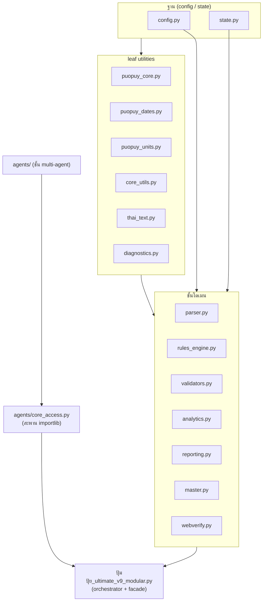
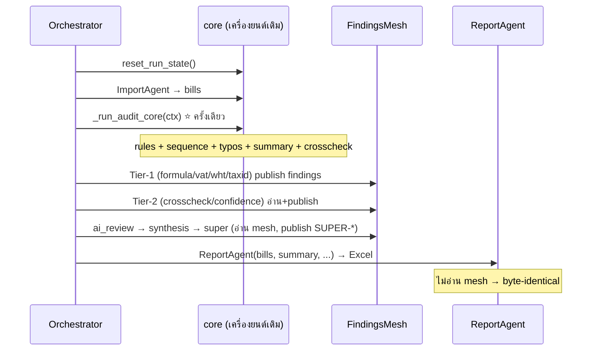

# เอกสารส่งมอบระบบ — ปุ้มปุ้ย v9 (Multi-Agent Mesh)

> ⚠️ **สถานะปัจจุบัน (อ่านก่อน) — แหล่งความจริงล่าสุด = `INVARIANTS/DECISIONS.md`**
> เอกสารนี้เป็น handoff ยุคแรก ตัวเลข baseline บางจุดด้านล่าง (`7b60b01f…`) เป็น **ของเก่า**.
> หลัง P4 + ซอยไฟล์ (ADR-006/007/008) + perf (ADR-009) **baseline ทางการของ 106 ไฟล์ (`/mnt/project`) = `35b2f7c8…`** (ดู ADR-019; สาย 81 ปลดระวาง)
> (ดู DECISIONS.md §1). งานคุณภาพล่าสุด: ADR-010 (validators branch 93.8%), ADR-011/012
> (คลังเลนส์ 22→**34**), Operability (doctor.py + VS Code — ดู `QUICKSTART_VSCODE_TH.md`).
> เริ่มเร็ว: `python3 doctor.py --full` → ตรวจความพร้อมจบในจอเดียว.

> ระบบตรวจสอบเอกสารภาษี/บิล (audit) ภาษาไทย — เครื่องยนต์เดิมที่พิสูจน์แล้ว ห่อด้วยสถาปัตยกรรม
> multi-agent แบบ **Hybrid Hierarchical + Mesh** โดยคง **byte-identical** (ผลตรวจเหมือนเดิมเป๊ะ)

เอกสารนี้คือจุดเริ่มต้นสำหรับผู้รับช่วงต่อ. คู่มือเชิงลึกของชั้น agent/mesh อยู่ใน
**`MESH_MANUAL_TH.md`** และประวัติการแยกโมดูล (decoupling) อยู่ใน **`PASS3_DECOUPLING_TH.md`**.

---

## 1. ระบบนี้ทำอะไร

อ่านไฟล์บิล/ใบกำกับ (`.xls`/`.xlsx`) → แยกข้อมูลรายบิล → รัน **56 กฎตรวจสอบ** →
ตรวจลำดับเลขที่ใบกำกับ/วันที่, รายการซ้ำ, คำผิดชื่อสินค้า, ความสอดคล้องชื่อไฟล์,
สรุปรายบริษัท → ออกรายงาน Excel (Dashboard + หลายชีต).

**ปรัชญาหลัก:** เสถียรภาพและความถูกต้องมาก่อนฟีเจอร์. ทุกการเปลี่ยนแปลงต้องผ่าน
**Golden Master** (SHA256 ของผลตรวจต้องไม่เปลี่ยน) ก่อนถือว่าเสร็จ.

---

## 2. สัญญาเหล็ก: Byte-Identical

ผลตรวจ "ที่เป็นทางการ" (ตัวที่กลายเป็น Excel) ถูก fingerprint ด้วย **SHA256**.
ตราบใดที่ค่านี้ไม่เปลี่ยน = พฤติกรรมเหมือนเดิมทุก field.

```
baseline (ชุดทางการ 106 ไฟล์ /mnt/project):
  7b60b01fa76438c6fd1db795da6f8b8b9ad62e2a63de6fc1f92a2feb8cf04e5d   ← ⚠️ ของเก่า (ก่อน P4/split/perf)
  BILLS=834 FILES=106 fn_issues=9 dup=1 iv_seq=28 iv_date=3 typos=42 companies=2
```
> ⚠️ baseline ทางการ **ปัจจุบัน = `35b2f7c8…`** (= `baseline.json._sha256`, ดู ADR-019). ค่า hash เก่าที่เคยใช้เก็บไว้ใน ADR-018/ADR-019 + เอกสารที่ลงวันที่ (ประวัติ).

**หัวใจที่ทำให้ปลอดภัย:** ชั้น agent ทั้งหมด (review/AI/synthesis/super) เป็น **advisory อ่านอย่างเดียว** —
ผลของมันไปอยู่ใน "mesh" (กระดานคำแนะนำ) เท่านั้น ไม่แตะ `ctx.bills`/ผลตรวจหลัก. และ
`ReportAgent` อ่านเฉพาะ `(bills, summary, iv_issues, typos, filename_issues)` — **ไม่อ่าน mesh** →
เพิ่ม agent ใหม่กี่ตัวก็ไม่กระทบ Excel.

### วิธีพิสูจน์ (รันเองได้)

```bash
cd ปุ้มปุ้ย_v9_multiagent

# (1) engine เดิม → hash
PYTHONHASHSEED=0 python3 golden_master.py . out.json /mnt/project

# (2) สาย agent (mesh + super ครบ) → ต้องได้ hash เดียวกัน
PYTHONHASHSEED=0 python3 verify_golden.py . out.json /mnt/project

# (3) ทดสอบสัญญาเชิงสถาปัตยกรรม (isolation/degrade/tier-2/3/super/mesh/determinism)
PYTHONHASHSEED=0 python3 test_agents.py . /mnt/project        # → ผ่าน 33/33

# (4) regression ครบวง (engine + agent) บนชุดข้อมูลใดก็ได้ — คำสั่งเดียว
PYTHONHASHSEED=0 python3 regression_full.py /mnt/project
```

---

## 3. สถาปัตยกรรม (2 ส่วน)

ระบบมีสองชั้นที่แยกหน้าที่ชัดเจน: **(ก) โมดูลเครื่องยนต์** (จากการ decoupling พาส 3) และ
**(ข) ชั้น agent mesh** ที่ห่อเครื่องยนต์.

### 3.1 โมดูลเครื่องยนต์ — Dependency DAG (ทิศทางเดียว ไม่มีวงวน)

พาส 3 แยก God File (4,951 บรรทัด) เป็นโมดูลที่พึ่งพากันทางเดียว (ไม่มี circular import):



> รายละเอียดการแยกโมดูล + เส้นทางลด main ต่อ (→ ~300) อยู่ใน `PASS3_DECOUPLING_TH.md`.

### 3.2 ชั้น Agent Mesh — Two-Plane (Hybrid Hierarchical + Mesh)

แยก **"ใครรันเมื่อไหร่" (control plane)** ออกจาก **"ใครเห็นผลของใคร" (data plane)**:

```mermaid
flowchart TB
    subgraph CTRL["Control plane — orchestrator.py (ลำดับคงที่ deterministic)"]
      direction TB
      imp["[1] ImportAgent ⚠critical<br/>ค้นไฟล์ + parse → bills"]
      core["⭐ _run_audit_core (ครั้งเดียว)<br/>dup→rules→iv_seq/date→typos→summary→crosscheck<br/>= ผลที่ออก Excel (byte-identical)"]
      t1["Tier-1 reviewers (อิสระ)<br/>formula · vat · wht · taxid"]
      t2["Tier-2 mesh consumers<br/>crosscheck · confidence"]
      ai["Tier-2.5 ai_review (Local LLM)"]
      syn["Tier-3 synthesis (capstone)"]
      sup["Tier-4 super (meta-supervisor) ★ใหม่"]
      rep["ReportAgent ⚠critical → Excel<br/>(อ่าน bills/summary เท่านั้น — ไม่อ่าน mesh)"]
      imp --> core --> t1 --> t2 --> ai --> syn --> sup --> rep
    end

    subgraph DATA["Data plane — FindingsMesh (blackboard)"]
      mesh[("findings เชิงคำแนะนำ<br/>publish / query / correlate")]
    end

    t1 -. publish .-> mesh
    t2 -. publish + อ่าน .-> mesh
    ai -. publish + อ่าน .-> mesh
    syn -. อ่านทั้ง mesh .-> mesh
    sup -. อ่าน mesh + ctx.results .-> mesh

    core === bills["ctx.bills (ผลหลัก)"]
    bills --> rep
    mesh -. ไม่เชื่อมกับ Excel .-x rep
```

**กุญแจ:** เส้นทึบ (bills → ReportAgent) คือผลทางการ. เส้นประ (mesh) คือคำแนะนำล้วน —
ตัด mesh ทิ้งทั้งหมด Excel ก็ยังเหมือนเดิม.

### 3.3 ลำดับการทำงาน (sequence)



---

## 4. Agents & Tiers

| Tier | Agent | บทบาท | critical | แตะ bills? |
|---|---|---|---|---|
| — | **import** | ค้นไฟล์ + parse → bills | ✅ | เขียน (ผลหลัก) |
| — | *(core)* | `_run_audit_core` รันกฎ/ลำดับ/สรุป (ครั้งเดียว) | — | เขียน (ผลหลัก) |
| 1 | **formula** | ตรวจซ้ำเชิงเลขคณิตอิสระ | ✗ | อ่าน |
| 1 | **vat** | รวบ/ชี้ประเด็น VAT | ✗ | อ่าน |
| 1 | **wht** | ภาษีหัก ณ ที่จ่าย (ภงด.53) | ✗ | อ่าน |
| 1 | **taxid** | เลขผู้เสียภาษี: checksum + ซ้ำข้ามบริษัท | ✗ | อ่าน |
| 2 | **crosscheck** | จับบิลที่หลายผู้ตรวจธงตรงกัน (`CROSS-CONFIRM`) | ✗ | อ่าน mesh |
| 2 | **confidence** | คะแนนความเชื่อมั่นความเสี่ยง/บิล (`CONF-SCORE`) | ✗ | อ่าน mesh |
| 2.5 | **ai_review** | triage รายบิล + อธิบาย (Local LLM) | ✗ | อ่าน mesh |
| 3 | **synthesis** | บทสรุปเชิงบริหารของ "เนื้อหา audit" (`AI-SYNTH-*`) | ✗ | อ่าน mesh |
| **4** | **super** ★ | **ผู้กำกับระบบ**: QA pipeline + รวมสัญญาณทุก tier เป็นลำดับเดียว + จับสัญญาณขัดแย้ง (`SUPER-*`) | ✗ | อ่าน mesh + results |
| — | **report** | เขียน Excel (เหมือนเดิม) | ✅ | อ่าน |
| — | **notepad** ★ | สรุปการทำงานทุก agent + super เป็นไฟล์ `.txt` (Notepad) — `NOTE-REPORT` | ✗ | อ่าน |

> Tier-4 **SuperAgent** เป็นของใหม่ในพาส 5 — ดูเชิงลึกใน `MESH_MANUAL_TH.md` §8.

---

## 5. ขนาดโค้ด (LOC)

| ส่วน | บรรทัด |
|---|---|
| `ปุ้มปุ้ย_ultimate_v9_modular.py` (orchestrator/facade) | 1,027 |
| โมดูลเครื่องยนต์ (parser/rules_engine/validators/analytics/reporting/…) | ~6,800 |
| ชั้น `agents/` (17 ไฟล์ รวม mesh + super) | ~2,300 |
| เครื่องมือพิสูจน์ (golden_master/verify_golden/test_agents/regression_full) | ~520 |

God File เดิม 4,951 → 1,027 บรรทัด (ลด ~79%) โดยผลตรวจ byte-identical ตลอด.

---

## 6. วิธีรัน

```bash
# ติดตั้ง dependency (ครั้งเดียว) — เวอร์ชันที่ล็อกไว้
pip install pandas==2.2.2 xlrd==2.0.1 openpyxl==3.1.5 rapidfuzz==3.10.1 matplotlib tqdm

# รันตรวจจริง (ผ่านสาย agent) + เขียน Excel
PYTHONHASHSEED=0 python3 run_agents.py            # (ดู flags ในไฟล์)

# เปิด AI advisory (ถ้ามี Local LLM เช่น Ollama) — ไม่บังคับ
#   options: enable_ai=True, llm_provider="ollama" (ไม่มี LLM = degrade เป็นสถิติ/deterministic อัตโนมัติ)
```

**รายงาน Notepad (.txt):** ทุกครั้งที่รันปกติ (write_report เปิด) ระบบจะสร้าง `agent_report.txt`
(UTF-8 + CRLF เปิดด้วย Notepad ได้ทันที) สรุปการทำงานของทุก agent แยกเป็นตัว ๆ + ส่วน SuperAgent.
ปรับด้วย options `write_note` (ดีฟอลต์ = ตาม write_report) และ `note_path`. เป็น advisory ไม่กระทบ Excel.

**หมายเหตุ AI:** ชั้น AI (ai_review/synthesis/super-brief) ใช้ Local LLM ผ่าน `agents/llm_provider.py`.
ถ้าต่อไม่ได้/ปิดไว้ → ระบบ degrade graceful (synthesis ใช้สถิติ, super ใช้ deterministic) ไม่พัง ไม่ค้าง.

---

## 7. Regression ทั้ง 2 ชุดข้อมูล

ระบบมี baseline ของ **ทั้งสองชุด** แล้ว:

| ชุด | บิล | baseline SHA256 | สถานะ |
|---|---|---|---|
| **106 ไฟล์** (`/mnt/project`, ทางการ) | 834 | **`35b2f7c8…`** (= baseline.json) | ✅ engine==agent==baseline (DECISIONS.md §1, ADR-019) |
| **33 ไฟล์** (ข้อมูลของคุณ) | 195 | `41cf259a…024f6123` | ✅ baseline บันทึกไว้ใน `baseline.json` + ตรวจความสมบูรณ์แล้ว (recompute hash ตรง) |

> `baseline.json` (1.3MB) ที่อยู่ในแพ็กเกจ **คือ golden snapshot ของชุด 33 ไฟล์**
> (n_files=33, n_bills=195, dup=1, iv_seq=1, iv_date=2, filename=7) พร้อมฟิลด์ `_sha256`.
> ผมยืนยันแล้วว่า hash ที่คำนวณซ้ำจากเนื้อใน = `_sha256` ที่บันทึก → baseline นี้ valid.
> (ไฟล์ดิบ 33 ไฟล์ไม่ได้แนบมาในแซนด์บ็อกซ์ จึงรัน engine สดที่นี่ไม่ได้ แต่ baseline พร้อมใช้)

**ทำไมชุด 33 ไฟล์มั่นใจได้แม้ยังไม่รันสดที่นี่:** สาย agent ใช้ `_run_audit_core` ชุดเดียวกับ engine
และพิสูจน์บนชุด 106 ไฟล์ทางการแล้วว่า **engine = agent เป๊ะ** → คุณสมบัตินี้ไม่ขึ้นกับชุดข้อมูล.
คุณยืนยันขั้นสุดท้ายบนเครื่องคุณด้วยคำสั่งเดียว:

```bash
# ยืนยันว่าไฟล์ 33 ไฟล์ของคุณยังให้ผลตรง baseline.json ที่ ship มา
PYTHONHASHSEED=0 python3 verify_golden.py . baseline.json /path/to/your_33files
#   ⚠️ baseline.json เป็นของ "ชุด 33 ไฟล์" → ต้องชี้ไปที่โฟลเดอร์ 33 ไฟล์ (ไม่ใช่ /mnt/project)

# หรือ regression ครบวง (engine + agent) — มี baseline ทั้ง 33 และ 81 ฝังไว้แล้ว
PYTHONHASHSEED=0 python3 regression_full.py /path/to/your_33files
#   ควรเห็น: "engine == agent : ✅"  และ  "ตรง baseline ที่ฝังไว้ของชุด 33 ไฟล์ : ✅"
```

---

## 8. วิธีขยาย (เพิ่ม agent ใหม่)

หลักการสั้น ๆ (รายละเอียด + โครงโค้ดอยู่ใน `MESH_MANUAL_TH.md` §6):

1. สร้างคลาสสืบทอด `agents.base.Agent`, ตั้ง `name`/`critical=False`, เขียน `_run(ctx)->AgentResult`.
2. อ่านผลเพื่อนผ่าน **mesh** (`ctx.mesh.by_*` / `correlate_by_bill`) — อย่าฮาร์ดโค้ดชื่อ agent.
3. คืน `findings` (advisory) — **ห้ามแตะ `ctx.bills`**.
4. ลงทะเบียนใน `orchestrator.py` (ตำแหน่งใน tier) + export ใน `agents/__init__.py`.
5. รัน `golden_master`/`verify_golden`/`test_agents` → ต้องยัง `35b2f7c8…` (= `baseline.json._sha256`, ดู ADR-019).

---

## 9. โครงสร้างไฟล์

```
ปุ้มปุ้ย_v9_multiagent/
├─ ปุ้มปุ้ย_ultimate_v9_modular.py   # orchestrator + facade
├─ parser.py rules_engine.py validators.py analytics.py reporting.py
├─ master.py webverify.py config.py state.py core_utils.py
├─ puopuy_core.py puopuy_dates.py puopuy_units.py thai_text.py diagnostics.py
├─ agents/
│   ├─ orchestrator.py  contracts.py  base.py  mesh.py        # แกน mesh
│   ├─ import_agent.py  formula_agent.py  vat_agent.py
│   ├─ wht_agent.py  taxid_agent.py  report_agent.py
│   ├─ crosscheck_agent.py  confidence_agent.py               # Tier-2
│   ├─ ai_review_agent.py  synthesis_agent.py                 # Tier-2.5/3
│   ├─ super_agent.py        ★ Tier-4 meta-supervisor
│   ├─ notepad_agent.py  notepad_report.py   ★ รายงาน .txt สรุปราย agent (ใหม่)
│   ├─ llm_provider.py  core_access.py  __init__.py
├─ golden_master.py  verify_golden.py                         # พิสูจน์ byte-identical
├─ test_agents.py                                             # สัญญาเชิงสถาปัตยกรรม (33 เคส)
├─ regression_full.py        ★ รัน regression ครบวง (ใหม่)
├─ HANDOVER_TH.md  MESH_MANUAL_TH.md  PASS3_DECOUPLING_TH.md   # เอกสาร
```

---

## 10. สิ่งที่ยังเหลือ (ไม่บังคับ — ทำต่อได้)

- **รีด main → ~300 บรรทัด:** ย้าย dependency-banner → `bootstrap.py`, display → `htmlout.py`,
  stage functions → `pipeline.py`, ถอด re-export facade (ดู `PASS3_DECOUPLING_TH.md` §4).
- **ยืนยันชุด 33 ไฟล์บนเครื่องคุณ:** baseline (`41cf259a…`) ฝังใน `regression_full.py` + `baseline.json` แล้ว
  เหลือเพียงรัน `verify_golden`/`regression_full` ชี้ไปโฟลเดอร์ไฟล์ดิบ 33 ไฟล์ เพื่อปิดวงพิสูจน์
- **ต่อ Local LLM จริง** (Ollama) เพื่อใช้ ai_review/synthesis/super-brief เต็มรูปแบบ.
